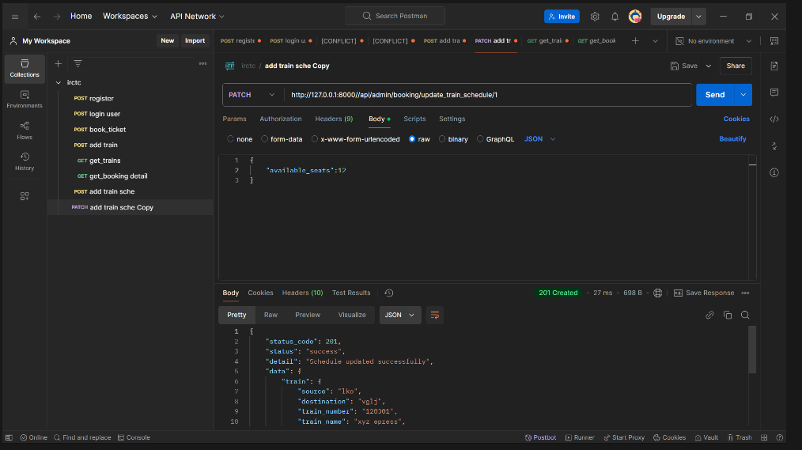
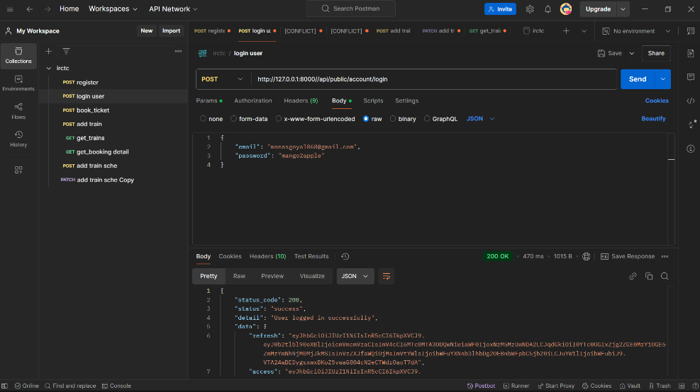
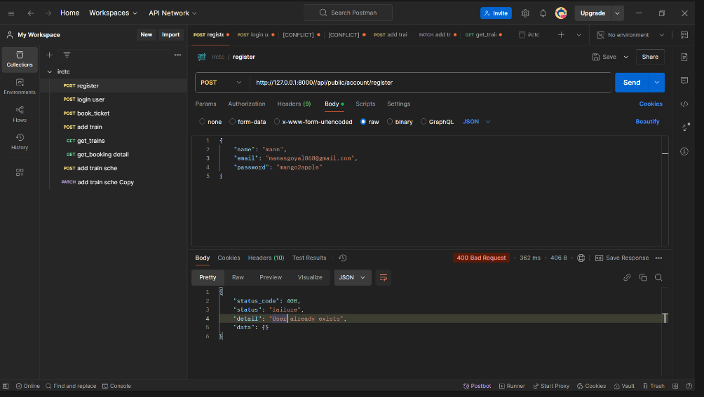
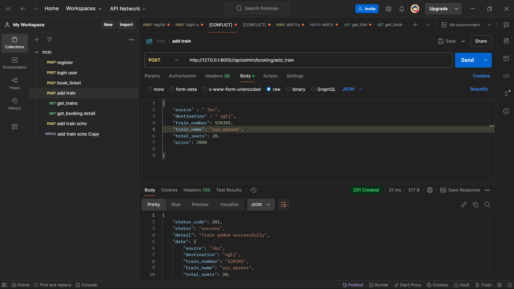
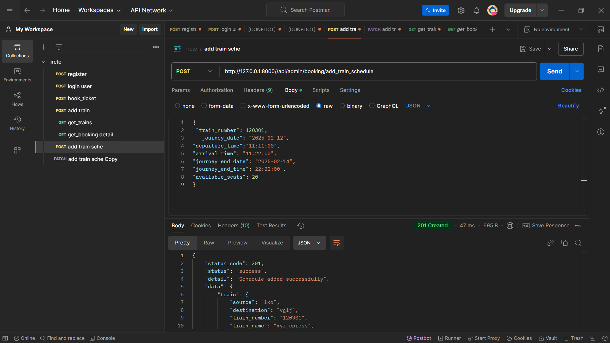
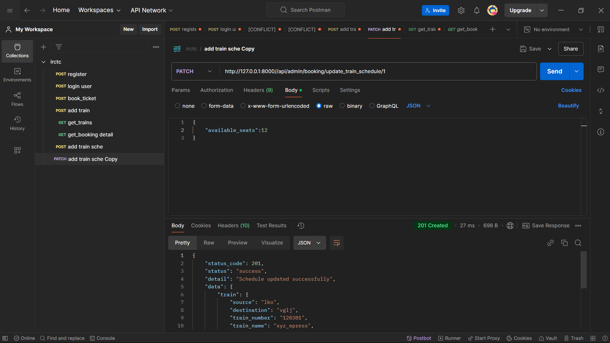

IRCTC Booking System (Django Version)

📌 Project Overview

This is a Train Ticket Booking System built using Django, Django REST Framework, and MySQL. It supports:

JWT Authentication for users.

API Key Authentication for admin endpoints.

Race Condition Handling to prevent multiple users from booking the same seat simultaneously.

🚀 Tech Stack

Backend: Python, Django, Django REST Framework (DRF)

Database: MySQL

Authentication: JWT (JSON Web Token) & API Key

